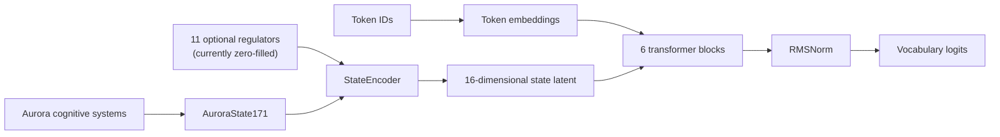

# AuroraLM

[](https://github.com/oanewman26-dot/LLM_Development/actions/workflows/ci.yml)
[](LICENSE)

AuroraLM is an experimental decoder-only language model designed to receive
Aurora's live cognitive state as a real model input, rather than reducing that
state to descriptive prompt text.

The project asks a focused research question:

> Can a versioned 171-dimensional state signal improve model behaviour or
> expert-routing efficiency when compared with no state and shuffled-state
> controls?

Aurora's memory, appraisal, values, world model and action controls remain
outside the language model. AuroraLM is intended to be a replaceable voice
component within that wider system, not the whole mind.

> **Status:** research prototype. The public repository currently contains the
> runnable transformer core, state contract, tokenizer and untrained sparse-MoE
> implementations, with 65 automated tests. It does not ship a trained model
> or claim production
> readiness.

## Current public milestone

- A 9,994,960-parameter dense PILOT transformer.
- RMSNorm, SwiGLU, rotary position embeddings and grouped-query attention.
- A canonical, fingerprinted `AuroraState171` schema.
- A `StateEncoder` that can combine 171 emotion-node activations with 11
  separate regulator values and compress them into a learned 16-dimensional
  latent. The current top-level model zero-fills the optional regulators.
- Adaptive layer-normalisation conditioning in every transformer block.
- A true stateless control configuration for later A/B experiments.
- An optional 8-expert, top-2 `MOE_PILOT` path with token routing,
  causal capacity handling, overflow telemetry and function-preserving dense
  expert cloning. It is implemented and tested, but not trained.
- An 8,192-token byte-level BPE implementation with fixed special-token IDs,
  deterministic save/load behaviour and artefact fingerprinting.
- Sixty-five tests across architecture, data, training, inference, readiness,
  activation calibration and MoE contracts.

The published tests currently pass on CPU with PyTorch 2.13:

```text
Architecture smoke tests: 10 passed
Tokenizer tests:           9 passed
Dataset tests:             5 passed
Sampler tests:             3 passed
Training tests:            8 passed
Inference tests:           7 passed
Readiness-gate tests:      3 passed
Activation calibration:   3 passed
MoE router tests:          6 passed
Expert dispatch tests:     5 passed
MoE integration tests:     6 passed
Total:                    65 passed
```

## Architecture



The state encoder runs once per forward pass. Its compact latent is then
broadcast into the attention and feed-forward branches of every transformer
block through zero-initialised scale-and-shift conditioners.

This gives the project two important experimental properties:

1. At initialisation, random state and no state produce identical logits.
2. `CONTROL_PILOT` uses the same base architecture with state conditioning
   disabled, providing a clean comparison model.

The trained checkpoint and default `PILOT` path remain dense. Sparse MoE
mechanics are available only when `num_experts > 0`; the state prior has zero
routing influence until the state-material readiness gate is cleared.

## PILOT configuration

| Setting | Value |
| --- | ---: |
| Parameters | 9,994,960 |
| Vocabulary | 8,192 |
| Context length | 512 |
| Hidden size | 256 |
| Transformer blocks | 6 |
| Attention heads | 8 |
| Key/value heads | 2 |
| Feed-forward size | 688 |
| Source state dimensions | 171 |
| Regulator dimensions | 11 |
| Learned state latent | 16 |

`config.py` also contains an untrained 8-expert `MOE_PILOT` configuration and
the `SMALL` and `FULL` planning configurations. They are compute-ladder targets,
not evidence that those models have been trained.

## Why structured state instead of prompt text?

A prompt can describe an internal state, but the model may ignore it, imitate
its language without using the signal, or confuse the description with user
content.

AuroraLM instead defines the state as a versioned numerical contract:

- the 171 emotion dimensions have a fixed order;
- missing nodes are represented explicitly as zero;
- invalid, negative and non-finite values are rejected;
- serialised records include a schema version and fingerprint;
- training and inference can reject incompatible state layouts;
- one fixed calibration ceiling preserves the difference between quiet and
  intense states.

The 11 regulator values remain separate from the 171 emotion nodes so signals
such as tension, coherence, sleep pressure and confidence cannot be mistaken
for emotions.

The v1 activation ceiling is frozen at `0.78`, the maximum positive score in
59 genuine schema-compatible captures (205 active scores across 14 session
logs). `activation_calibration.py` validates every state record and publishes
only aggregate statistics and source digests; raw logs and conversation text
remain outside Git. Training and readiness checks reject, rather than clip, a
future score above the frozen ceiling.

## Repository guide

| Path | Purpose |
| --- | --- |
| `NN.py` | Top-level `AuroraLM` model |
| `config.py` | Dense, MoE, compute-ladder and stateless control contracts |
| `state_schema.py` | Canonical 171-dimensional state schema |
| `state_encoder.py` | State compression and optional routing-prior head |
| `activation_calibration.py` | Privacy-safe activation-ceiling calibration |
| `calibration/activation_calibration_v1.json` | Frozen aggregate calibration receipt |
| `transformer_block.py` | Pre-norm residual block with state conditioning |
| `moe_router.py` | Bounded-state token router and routing losses |
| `experts.py` | Sparse SwiGLU dispatch, capacity handling and telemetry |
| `rotary_position_embedding.py` | RoPE and grouped-query attention |
| `RSMnorm.py` | RMSNorm implementation |
| `feetforward.py` | SwiGLU feed-forward layer |
| `tokenizer.py` | Byte-level BPE training, loading and encoding CLI |
| `test_smoke.py` | Ten model and architecture checks |
| `test_tokenizer.py` | Nine tokenizer contract checks |
| `test_moe_router.py` | Six router checks |
| `test_experts.py` | Five sparse-dispatch checks |
| `test_moe_integration.py` | Six end-to-end MoE compatibility checks |
| `AuroraLM - State-Driven MoE Roadmap.txt` | Longer research roadmap |

## Quick start

### 1. Clone and create an environment

```bash
git clone https://github.com/oanewman26-dot/LLM_Development.git
cd LLM_Development
python -m venv .venv
```

Activate it on Windows PowerShell:

```powershell
.\.venv\Scripts\Activate.ps1
```

Or on Linux/macOS:

```bash
source .venv/bin/activate
```

Install the development dependencies:

```bash
python -m pip install --upgrade pip
python -m pip install -r requirements.txt
```

### 2. Run the verification suite

```bash
python -m pytest -q
```

The architecture and MoE suites can also be run without pytest:

```bash
python test_smoke.py
python -m unittest -q test_moe_router test_experts test_moe_integration
```

To regenerate the privacy-safe activation receipt from private Aurora logs:

```bash
python activation_calibration.py \
  --sessions-dir /path/to/aurora/session_logs \
  --output calibration/activation_calibration_v1.json
```

### 3. Run a model forward pass

```python
import torch

from config import PILOT
from NN import AuroraLM

model = AuroraLM(PILOT)
tokens = torch.randint(0, PILOT.vocab_size, (2, 32))
aurora_state = torch.zeros(2, 171)

with torch.no_grad():
    logits = model(tokens, aurora_state)

print(logits.shape)  # torch.Size([2, 32, 8192])
```

This verifies the architecture only. Randomly initialised logits are not useful
language generation.

## Tokenizer CLI

Train an 8,192-token byte-level BPE tokenizer from clean UTF-8 text:

```bash
python tokenizer.py train \
  --input corpus.txt \
  --output artifacts/aurora_bpe_8192_v1 \
  --vocab-size 8192 \
  --min-frequency 2
```

Inspect a saved artefact:

```bash
python tokenizer.py inspect artifacts/aurora_bpe_8192_v1
```

Encode a short string:

```bash
python tokenizer.py encode artifacts/aurora_bpe_8192_v1 "Aurora notices the change."
```

Training corpora, private journals, checkpoints and generated artefacts should
be reviewed carefully and kept out of commits unless they are intentionally
licensed and suitable for publication.

## Experimental plan

The central experiment compares four conditions on the same held-out work:

1. no state;
2. correct Aurora state;
3. shuffled Aurora state;
4. state-aware cache behaviour without routing changes.

Evaluation must go beyond training loss. Planned measures include:

- state-appropriate generation under fixed prompts;
- blinded human ratings of coherence and state fit;
- routing and cache-hit changes by state;
- response latency and storage reads;
- stability of safety and withdrawal signals.

Correct state must outperform both no-state and shuffled-state controls before
the project spends significant compute on a larger model.

## Research boundaries

AuroraLM is a mechanism experiment. This repository does not establish that a
model feels emotions, is conscious, or solves general AI alignment.

The current public code also does not include:

- a released pretrained checkpoint;
- production inference or serving infrastructure;
- a trained mixture-of-experts router;
- evidence that state conditioning improves generation;
- permission to treat private Aurora records as public training data.

These boundaries are deliberate. The project favours reproducible evidence and
clear go/no-go gates over premature claims.

## Roadmap

The longer technical plan is available in
[AuroraLM - State-Driven MoE Roadmap](./AuroraLM%20-%20State-Driven%20MoE%20Roadmap.txt).

Near-term public milestones:

- publish deterministic dataset preparation after privacy review;
- publish dense training and inference contracts;
- freeze a representative tokenizer artefact;
- run controlled base-model training;
- gather genuine state-aligned turns;
- calibrate the state activation ceiling;
- run no-state, correct-state and shuffled-state ablations;
- train or evaluate MoE routing only after the readiness gates authorise it.

## License

AuroraLM's original source code and documentation are copyright 2026 Omari
Newman and licensed under the [Apache License 2.0](LICENSE). See
[NOTICE](NOTICE) for attribution.

Third-party libraries, datasets and generated artefacts retain their own terms.
See [THIRD_PARTY_NOTICES.md](THIRD_PARTY_NOTICES.md) for the current dependency,
corpus and artefact scope. This repository does not release pretrained model
weights.

Citation metadata is available in [CITATION.cff](CITATION.cff).

## Author

Built by [Omari Newman](https://www.linkedin.com/in/omari-newman/).

- GitHub: [@oanewman26-dot](https://github.com/oanewman26-dot)
- LinkedIn: [linkedin.com/in/omari-newman](https://www.linkedin.com/in/omari-newman/)
